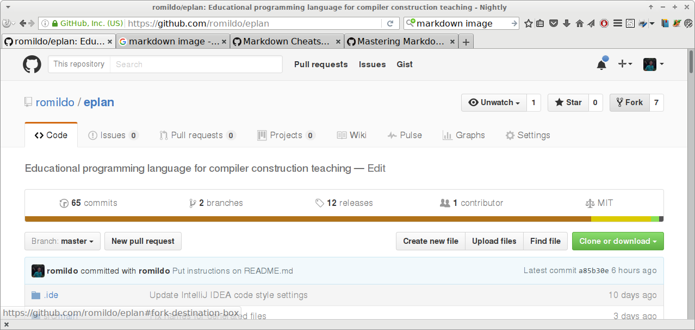

# EPLan

EPLan is an educational programming language for compiler construction
teaching.

EPlan is used to teach compilation techniques to undergraduate students
at Universidade Federal de Ouro. The language specification starts with
a very minimal kernel and grows with new features as new techniques are
learnt.

Tags will be used to give access to each important stage of the
compiler implementation.

## Development tools needed

- [GIT](https://git-scm.com/)
- [Java development kit](http://www.oracle.com/technetwork/java/javase/downloads/) (version 1.8 or greater)
- C compiler
- [Maven](https://maven.apache.org/)
- Text editor for software development (Suggested: [Atom](https://atom.io/), [Notepad++](https://notepad-plus-plus.org/), gedit, [Emacs](https://www.gnu.org/software/emacs/))
- IDE for Java development (optional) (suggested: [IntelliJ IDEA](https://www.jetbrains.com/idea/))

## Notice about using Windows

One of the library dependencies of the project (`javacpp-presets-llvm`)
currently is not available for Windows, and because of that the Windows
platform is not supported at the moment.

## Initial setup to work with EPlan in BCC328

In order to develop the activities of the BCC328 (Compiler Construction) course you should:

- Have a [github](https://github.com/) account. If you do not have one, visit the github site and [sign up](https://github.com/join).
- [Log in](https://github.com/login) the github.
- Visit the [EPLan](https://github.com/romildo/eplan) project page.
- Fork the EPlan project.

- In your computer clone your fork of the eplan project. Notice that in the commands that follow any text written between angular braces `<>` shold be replaced by an appropriate text. For instance `<working directory` should be replaced by the name of directory (folder) for working activities.
```
$ cd <working directory>
$ git clone https://github.com/romildo/eplan.git
$ cd eplan
```
- Set the remote repository for your clone
```
$ git remote add upstream https://github.com/romildo/eplan.git
$ git remote -v
```

## When testing a version of the eplan compiler

- Change your working directory to the folder containing your clone.
```
$ cd <working directory>
```
- Select the master branch of the clone of your forked project.
```
$ git branch
$ git checkout master
```
- Pull the latest changes from the remote repository.
```
$ git pull upstream master
```
- Select the appropriate branch for the activity.
```
$ git checkout -b <activity>
```
- Develop the activity.

## To submit an activity

- Select the master branch of the clone of your forked project.
```
$ cd <working directory>
$ git checkout master
```
- Pull the latest changes from the remote repository.
```
$ git pull upstream master
```
- Create a new branch where you will develop the activity.
```
$ git checkout -b <activity>
```
- Develop the activity.
- See the status of your cloned repository:
```
git status
```
- Add any new or modified file to the revision history:
```
git add <files>
```
- Commit the changes:
```
git commit -m <message>
```
- Push your changes to your forked project.
```
git push origin <activity>
```
- Make a pull request (PR) from your forked project at github.

## Some useful commands

### To remove the generated files 

```
$ mvn clean
```

### To compile the project

```
$ mvn compile

```

### To make `jar` files of the project

```
$ mvn package
```

### To run the eplan compiler

The EPlan compiler accepts some command line options. A summary of its
usage can be obtained with the `--help` option:

```
$ java -jar target/uber-eplan-0.1-SNAPSHOT.jar --help
```

Run the EPLan compiler with the command line:

```
$ java -jar target/uber-eplan-0.1-SNAPSHOT.jar [options] [file]
```

Or you may use the provided shell script `driver`:

```
$ ./driver <file>
```

There is also the `run` script, which runs the compiler on the standard
input, and generates and runs the executable. It also shows the image of
the abstract syntax tree. For that the
[Graphviz](http://www.graphviz.org/) package is needed.

```
$ ./run
```

The current version of the library `javacpp-presets-llvm` is based on a
LLVM release that has an issue regarding floating point constants in the
LLVM IR language. It follows the locale setting for numeric formatting
and at the same time it does not accept a comma instead of a dot in the
literal. You may have to set you locale numeric setting to `en_US-UTF-8`
for it to work.

```
$ LC_NUMERIC=en_US-UTF-8 java -jar target/uber-eplan-0.1-SNAPSHOT.jar [options] [file]
```

or with the provided shell script `driver`:

```
$ LC_NUMERIC=en_US-UTF-8 ./driver <file>
```

A better alternative may be setting your language to `en_US-UTF-8` in
the system configuration.

The generated LLVM intermediate representation code should be compiled
with the `llc`:

```
$ llc <file>.ll
```

The generated assembly code and the runtime library should be compiled and linked with a C compiler. If using CLang:

```
$ clang -o <file>.exe src/main/c/bindings.c <file>.s
```

Or if using GCC:

```
$ gcc -o <file>.exe <file>.s src/main/c/bindings.c
```

To get an image of the syntact tree of your program:

```
$ dot -O -Tpng <file>.dot <file>.dot
$ eog <file>.dot.png
```

Finally run the binary obtained for the eplan source code:

```
$ ./<file>.exe
```

These steps can be combined in a single command line:
```
$ F=<file> && ./driver $F && llc $F.ll && clang -o $F.exe $F.s src/main/c/bindings.c && dot -O -Tpng $F.dot && eog $F*png && ./$F.exe
```
